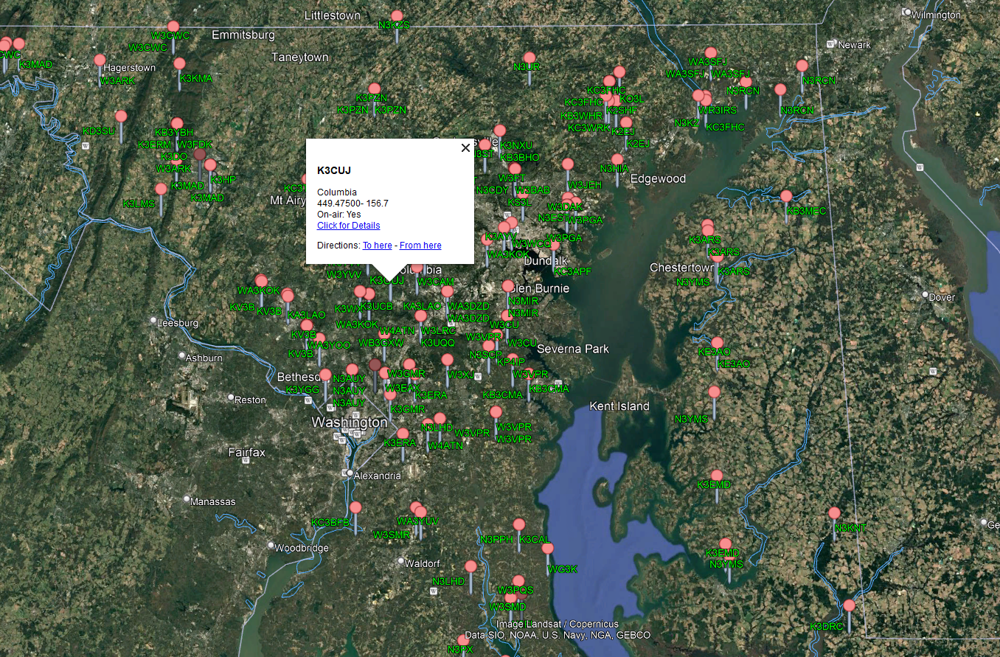

# hamtak-resources
Resources for HAM-related ATAK activities. Github is a bit new to me so we're going to try this out. Check out the /kmls folder for repeater KML files. Right now, the file loads well into Google Earth. We will want to clean it up for ATAK. 

